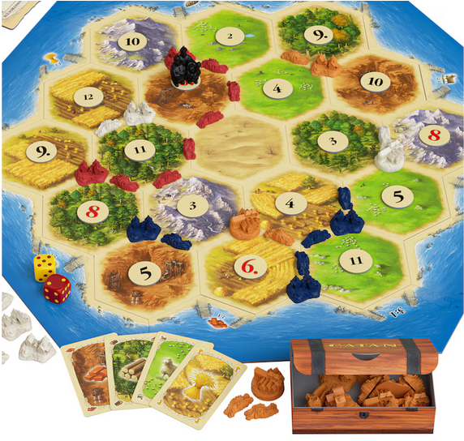

# 🎲 Bayesiánus modellezés és valószínűségelmélet

Tudjuk:

1. Mit jelent egy valószínűségi algoritmikus modell.

Kell még:

2. Hogyan írjuk le a valószínűségeket a **Kolmogorov-axiómák** segítségével?

3. Hogyan jutunk el a **feltételes valószínűségig** és a **Bayes-inferenciáig**?

## 1. A Kolmogorov-axiómák (a játékszabályok)

A valószínűség matematikai reprezentációjának alapja az $(\Omega,\Sigma,P)$ hármas, amit **valószínűségi mezőnek** nevezünk:
* $\Omega$: az **elemi események tere** (az összes lehetséges kimenetel halmaza, ami megtörténhet).
* $\Sigma$: az **eseménytér** (az elemi eseményekből álló halmazok, pl. "páros számot dobunk").
* $P$: a **valószínűségi mérték** (egy függvény, ami megmondja, mi mekkora eséllyel történik).

Formálisan a $P$ függvénynek három feltételt kell betartania:

> **1. Nemnegativitás:** Minden $A\in\Sigma$ eseményre a valószínűség sosem negatív:

$$P(A)\ge 0$$
 
> **2. Normáltság:** A teljes eseménytér (valaminek biztosan történnie kell) valószínűsége 1, a lehetetlen eseményé pedig 0:

$$P(\Omega)=1 \qquad \text{és} \qquad P(\varnothing)=0$$
 
> **3. Additivitás:** Ha $A,B\in\Sigma$ **egymást kizáró események** (azaz $A\cap B=\varnothing$), akkor:

$$P(A\cup B)=P(A)+P(B)$$

## 2. Következmények és további fogalmak

Az axiómákból nagyon hasznos hétköznapi szabályok következnek.

### 🔄 Komplementer-szabály
Ha egy $A$ esemény valószínűsége $P(A)$, akkor annak az esélye, hogy **NEM** következik be:
$$P(A^c)=1-P(A) \qquad \text{vagy informálisan:} \qquad P(\neg A)=1-P(A)$$

### Logikai szita formula (VAGY kapcsolat)
Ha két esemény nem zárja ki egymást, vigyázni kell, nehogy kétszer számoljuk a közös részt!
$$P(A\cup B)=P(A)+P(B)-P(A\cap B)$$

### 🔗 Függetlenség (ÉS kapcsolat)
**Definíció:** Két esemény (A és B) akkor **független** egymástól, ha metszetük (együttes bekövetkezésük) valószínűsége a szorzatuk:
$$P(A\cap B)=P(A)\cdot P(B)$$

Azaz ha az egyik bekövetkezése nem ad információt a másikról.

### 💻 WebPPL példa: halmazműveletek és eseménytér a dobókockán

A valószínűségszámításban az események valójában halmazok, a rajtuk végzett műveletek (metszet, unió, komplementer) pedig a programozásban egyszerű logikai operátoroknak (`&&`, `||`, `!`) felelnek meg. 

Nézzünk egy komplexebb példát egy dobókockával!

```javascript
var model = function() {
  // 1. Elemi események tere (Ω): 1-től 6-ig egyenlő eséllyel
  var dobas = randomInteger(6) + 1; 

  // 2. Alapesemények definiálása
  var A = (dobas % 2 === 0);       // A: Páros szám (2, 4, 6) -> P(A) = 3/6 = 0.5
  var B = (dobas > 3);             // B: Nagyobb, mint 3 (4, 5, 6) -> P(B) = 3/6 = 0.5

  // 3. Halmazműveletek (Kolmogorov-axiómák és következményeik)
  
  // Komplementer (A^c): NEM páros (tehát páratlan: 1, 3, 5)
  var komplementer_A = !A;         
  
  // Metszet (A ∩ B): Páros ÉS nagyobb, mint 3 (Közös rész: 4, 6)
  var metszet = A && B;            
  
  // Unió (A ∪ B): Páros VAGY nagyobb, mint 3 (Összes érintett: 2, 4, 5, 6)
  var unio = A || B;               
  
  // Különbség (A \ B): Páros, DE nem nagyobb, mint 3 (Csak a 2-es)
  var A_minusz_B = A && !B;        

  // Visszaadjuk az összes eseményt, hogy lássuk a valószínűségi eloszlásukat
  return {
    "1_P(A) [Páros]": A,
    "2_P(B) [Nagyobb 3]": B,
    "3_P(A^c) [Komplementer]": komplementer_A,
    "4_P(A ∩ B) [Metszet]": metszet,
    "5_P(A ∪ B) [Unió]": unio,
    "6_P(A \\ B) [Különbség]": A_minusz_B
  };
};

// Az enumerate módszer végigzongorázza mind a 6 lehetséges univerzumot,
// és kiszámolja az egyes események (halmazok) pontos valószínűségét.
var eloszlas = Infer({method: "enumerate", model: model});
viz.marginals(eloszlas);
```

**Mit fogunk látni az eredményben?**
* **$P(A \cap B)$ (Metszet):** `0.333` (kb. 33%), hiszen a 6 lehetőségből csak a 4-es és a 6-os felel meg mindkét feltételnek (2/6).
* **$P(A \cup B)$ (Unió):** `0.666` (kb. 66%), hiszen a 2, 4, 5, 6 kimenetelek mind jók nekünk (4/6). Itt gyönyörűen látszik az Unió szabálya is: $0.5 + 0.5 - 0.333 = 0.666$.


### 💻 WebPPL példa: függetlenség és unió
Nézzük meg, mi történik, ha két független eseményünk van (A és B)!

```javascript
var model = function() {
  var A = flip(0.3); // P(A) = 0.3
  var B = flip(0.4); // P(B) = 0.4
  
  return {
    metszet: A && B, // P(A ∩ B) = 0.3 * 0.4 = 0.12
    unio: A || B     // P(A ∪ B) = 0.3 + 0.4 - 0.12 = 0.58
  };
};

viz.marginals(Infer({method: "enumerate", model: model}));
```

## 3. Eloszlások (hogyan oszlik meg a valószínűség?)

Egy valószűnűségi **eloszlás** azt mondja meg, hogyan rendeljük hozzá a valószínűséget ($P$) a lehetséges kimenetekhez.
* **Diszkrét esetben:** egyszerűen felsoroljuk a kimeneteleket és a %-os esélyüket.
* **Folytonos esetben:** sűrűségfüggvénnyel vagy eloszlásfüggvénnyel dolgozunk (később).

### 🎲 A "Catan-eloszlás"



A *Catan telepesei* (Settlers of Catan) nevű társasjátékban el van rejtve egy matematikai feladvány. A táblán hatszögletű mezők vannak, rajtuk 2-től 12-ig számok. A játékosok a körük elején **két dobókockával** dobnak, és a kapott összeg határozza meg, melyik számú mezők adnak nyersanyagot (fát, gabonát, ...).

Egyetlen kocka dobása egyenletes eloszlású, de **két kocka összege már nem az**: 

* A 7-es összeg a leggyakoribb, mert **hatféleképpen** jöhet ki (1+6, 2+5, 3+4, 4+3, 5+2, 6+1).
* A 2-es vagy a 12-es viszont nagyon ritka, mert csak **egyféleképpen** jöhet ki (1+1 vagy 6+6).

A játék tervezői beépítették ezt a matekot: a számkorongokon apró pöttyök jelzik, hány elemi esemény (kockakombináció) vezet ahhoz az összeghez. A 6-os és 8-as alatt 5 pötty van, a 12-es alatt csak 1. Amikor Catan-t játszunk, valójában egy diszkrét együttes eloszlásra (joint eloszlásra) fogadsz!

### 💻 WebPPL példa: két kocka összege
Lássuk, hogyan generálódik a piramis-alakú Catan-eloszlás a kódban!

```javascript
var model = function() {
  // Két független, szabályos dobókocka (uniform eloszlás 1-től 6-ig)
  var kocka1 = randomInteger(6) + 1;
  var kocka2 = randomInteger(6) + 1;

  // A valószínűségi változónk (X) a két kocka összege
  var X = kocka1 + kocka2;

  return X;
};

// Az 'enumerate' végigveszi az összes (6x6 = 36) lehetséges elemi kimenetelt
var eloszlas = Infer({method: "enumerate", model: model});
viz.auto(eloszlas);
```

### Catan játék szimuláció

```javascript
var catanKor = function() {
  // 1. A sors keze: golyóálló kockadobás definiálása
  // A WebPPL automatikusan elosztja a valószínűségeket (1/6 mindegyikre)
  var kocka1 = categorical({ps: [1,1,1,1,1,1], vs: [1,2,3,4,5,6]});
  var kocka2 = categorical({ps: [1,1,1,1,1,1], vs: [1,2,3,4,5,6]});
  
  var dobas = kocka1 + kocka2;

  // 2. A játék logikája (Kimenetelek kiértékelése)
  var eredmeny = 
    (dobas === 7) ? "1_RABLÓ (7-es)" :
    (dobas === 8 || dobas === 6) ? "2_NYERŐ (6-os vagy 8-as)" :
    (dobas === 3) ? "3_MEGLEPI, fa (ritka 3-as)" :
    "4_UNCSI (a többi szám)";

  return eredmeny;
};

// Végigzongorázzuk az összes párhuzamos univerzumot (36 eset)
var eloszlas = Infer({method: "enumerate", model: catanKor});

// Kirajzoljuk a pontos esélyeket (a viz() vagy viz.auto())
viz.auto(eloszlas);
```

## 4. Függő változók és a feltételes valószínűség

A valószínűségi változók gyakran **függenek egymástól**. Például a közlekedési dugó valószínűsége függhet attól, hogy esik-e az eső.

### 🌧️ A "pesti dugó" modell
* Eső ($R$): $P(R=\text{igen})=\frac{1}{3}$, $P(R=\text{nem})=\frac{2}{3}$
* Dugó ($T$), **ha esik**: $P(T=\text{dugó}\mid R=\text{igen})=\frac{1}{2}$
* Dugó ($T$), **ha nem esik**: $P(T=\text{dugó}\mid R=\text{nem})=\frac{1}{4}$

### 💻 WebPPL példa

```javascript
var model = function () {
  var R = categorical({
    ps: [1/3, 2/3],
    vs: ["esik", "nem esik"]
  });

  // A dugó eloszlása FÜGG az eső értékétől (feltételes eloszlás)
  var T = (R === "esik") 
      ? categorical({ps: [1/2, 1/2], vs: ["dugó", "nincs dugó"]})
      : categorical({ps: [1/4, 3/4], vs: ["dugó", "nincs dugó"]});

  return { Idojaras: R, Kozlekedes: T };
};

viz.table(Infer({method: "enumerate", model: model}));
```

### 🧮 A teljes valószínűség tétele (marginalizáció)
Ha arra vagyunk kíváncsiak, mekkora a dugó esélye *összességében* (függetlenül az esőtől), össze kell adnunk az ágakat:

$$P(T=\text{dugó}) = P(T=\text{dugó}\mid R=\text{igen})P(R=\text{igen}) + P(T=\text{dugó}\mid R=\text{nem})P(R=\text{nem})$$

$$P(T=\text{dugó}) = \frac{1}{2}\cdot\frac{1}{3} + \frac{1}{4}\cdot\frac{2}{3} = \frac{1}{6} + \frac{1}{6} = \frac{1}{3}$$

Ezek motiválják a feltételes valószínűséget.

## 5. Feltételes valószínűség

A feltételes valószínűség lényege, hogy **leszűkítjük az elemi események terét** a feltételnek megfelelő esetekre. Ha tudjuk, hogy $B$ megtörtént, már csak $\Omega$ ezen részében gondolkodunk.

> **Definíció:** Ha $P(B)\neq 0$, akkor az $A$ esemény feltételes valószínűsége $B$ bekövetkezése esetén:

$$P(A\mid B)=\frac{P(A\cap B)}{P(B)}$$

Ebből egyenesen következik a **szorzatszabály** (ami a Bayes-tétel alapja is):

$$P(A\cap B)=P(A\mid B)\cdot P(B)$$

## 6. Joint (többváltozós, együttes) eloszlás vs. feltételes eloszlás

### 🃏 A pénzérme és kártya példa
Legyen $X$ egy érmefeldobás ($1=$ Fej, $0=$ Írás, 50-50%). 
Legyen $Y=1$ az, hogy királyt húzunk egy pakliból. 
* Ha $X=1$ (Fej), magyar kártyapakliból húzunk: $P(Y=1\mid X=1) = \frac{1}{8}$
* Ha $X=0$ (Írás), francia kártyapakliból húzunk: $P(Y=1\mid X=0) = \frac{1}{13}$

```javascript
var model = function () {
  // 1. A független változó (X): érmefeldobás
  var fej = flip(0.5); 

  // 2. A függő változó (Y): királyt húzunk-e?
  // Ha fej (magyar pakli): 1/8 az esély. Ha írás (francia pakli): 1/13 az esély.
  var kiraly = fej ? flip(1/8) : flip(1/13); 

  // Visszaadjuk a teljes univerzumot (X és Y együttesét)
  return {
    "pakli (X)": fej ? "1_magyar (fej)" : "2_francia (írás)",
    "húzás (Y)": kiraly ? "👑 király" : "nincs király"
  };
};

// Az enumerate kiszámolja a Joint táblázatot
var jointEloszlas = Infer({method: "enumerate", model: model});
viz.auto(jointEloszlas);
```

| Feltételes eloszlás $P(Y \mid X)$ | $X=1$ | $X=0$ |
| :--- | :---: | :---: |
| $P(Y=1\mid X)$ | $1/8$ | $1/13$ |
| $P(Y=0\mid X)$ | $7/8$ | $12/13$ |

*(Figyeld meg: az oszlopok összege ad ki 1-et, hiszen rögzített X mellett ezek valóságos eloszlások.)*

A **Joint (együttes) eloszlás** $P(X,Y)$ megkapható a szorzatszabállyal: $P(X,Y) = P(Y \mid X) \cdot P(X)$. Mivel $P(X)=0.5$, minden cellát elosztunk kettővel:

| Joint eloszlás $P(X, Y)$ | $X=1$ | $X=0$ |
| :--- | :---: | :---: |
| $Y=1$ | $1/16$ | $1/26$ |
| $Y=0$ | $7/16$ | $6/13$ |

*(Itt már a teljes táblázat (az összes cella) összege 1, mert ez az összes lehetséges univerzum terét írja le.)*

### 💡 Likelihood (Mi a különbség?)
Ha a kimenet ($Y=y_j$) van rögzítve (pl. megfigyeltük, hogy királyt húztunk), és azt vizsgáljuk, ez mennyire valószínű az $X$ különböző paraméterei (modellek) mellett, azt **Likelihood-függvénynek** hívjuk. Ennek az értékei nem feltétlenül adnak ki 1-et!

## 7. Bayesiánus inferencia: visszafelé következtetés

A Bayesiánus gondolkodásban megkülönböztetünk:
* **Prior eloszlást:** Amit a világ működéséről gondolunk a megfigyelés előtt.
* **Posterior eloszlást:** A frissített tudásunkat az adatok (megfigyelések) megismerése után.

### 💻 WebPPL példa: "Esett vagy nem esett, ha tudom, hogy késtem?"

A `condition()` utasítás szelektál. Leszűkítjük a lehetséges világok számát azokra, ahol a késés tényleg megtörtént.

```javascript
var model = function () {
  // 1. PRIOR MODELLEZÉS (Ahogy a világ generálódik)
  var eso = flip(1/5);
  var dugo = eso ? flip(1/2) : flip(1/4);
  var keses = dugo ? flip(0.9) : flip(0.05);

  // 2. MEGFIGYELÉS (Likelihood beépítése / szűrés)
  // Csak azokat a világokat tartjuk meg, ahol tényleg késtem!
  condition(keses === true);

  // 3. POSTERIOR (Visszaadjuk a frissített valószínűségeket)
  return {
    eso_volt: eso,
    dugo_volt: dugo
  };
};

// Mivel itt kis állapottér van, az 'enumerate' kiszámolja a tökéletesen pontos poszteriort!
var Posterior = Infer({method: "enumerate", model: model});
viz.marginals(Posterior);
```

Amikor ezt lefuttatod, látni fogod: az eső eredeti 20%-os esélye (prior) drasztikusan megugrik a posteriorban, mert a késés ténye (a likelihoodon keresztül) erős bizonyíték arra, hogy az utakon valami gond volt!

---

## Fogalmak

* **$\Omega$ (Elemi események tere):** minden, ami megtörténhet.
* **$\Sigma$ (Eseménytér):** az események (részhalmazok), amiknek valószínűséget adhatunk.
* **$P$ (Valószínűségi mérték):** a Kolmogorov-axiómákat teljesítő függvény.
* **Joint (együttes) eloszlás:** változók együttmozgásának teljes térképe, $P(X,Y)$. A cellák összege 1.
* **Feltételes eloszlás:** egy változó eloszlása egy másik *rögzített* értéke mellett, $P(Y \mid X)$. Az oszlopok összege 1.
* **Marginalizáció:** egy vagy több változó "kiejtése" a joint eloszlásból egyszerű összeadással.
* **Prior:** amit azelőtt tudtunk, hogy megláttuk volna az adatot.
* **Posterior:** a frissített tudásunk az adat megfigyelése után.
* **Likelihood:** megmutatja, hogy egy megfigyelt adat mennyire valószínű a különböző hipotézisek/modellek fényében.

---

## Útravaló:

Miért nem ugyanaz a feltételes eloszlás táblázata és a joint eloszlás táblázata? 
